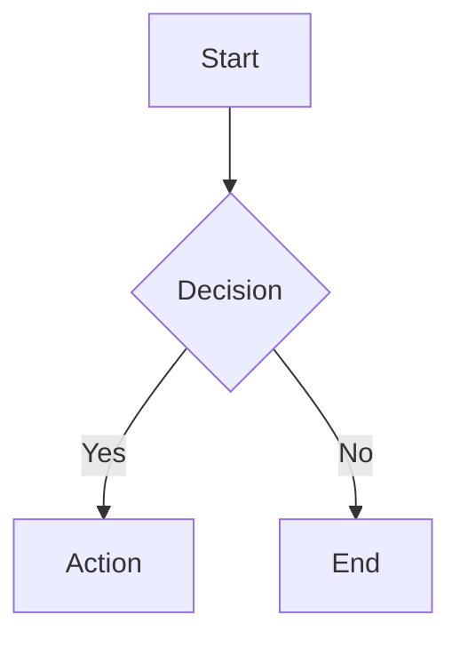

# Obsidian Notes (Enhanced)

Create and manage notes in your Obsidian vault with advanced features including daily notes, backlinks, tag management, and graph analysis.

## Vault Location

Default vault: `C:\Users\Bl0ck\(ph)`

## Available Tools

### obsidian_create_note
Create a new note in the vault.

```json
obsidian_create_note {"title": "My Note", "content": "Note content here", "tags": ["tag1", "tag2"]}
```

### obsidian_daily_note
Create or open today's daily note.

```json
obsidian_daily_note {}
```

Or for a specific date:
```json
obsidian_daily_note {"date_str": "2026-02-05"}
```

### obsidian_backlinks
Find all notes that link to a given note.

```json
obsidian_backlinks {"note_name": "My Important Note"}
```

### obsidian_list_tags
List all tags used in the vault with counts.

```json
obsidian_list_tags {}
```

### obsidian_find_by_tag
Find all notes with a specific tag.

```json
obsidian_find_by_tag {"tag": "project"}
```

### obsidian_graph_neighbors
Get linked notes (incoming and outgoing links) for a note.

```json
obsidian_graph_neighbors {"note_name": "Hub Note"}
```

### obsidian_search
Search for text across all notes.

```json
obsidian_search {"query": "search term", "limit": 20}
```

### obsidian_recent
List recently modified notes.

```json
obsidian_recent {"limit": 10}
```

## Quick Examples

### Create a note with tags
```json
obsidian_create_note {"title": "Meeting Notes", "content": "Discussion points...", "folder": "Meetings", "tags": ["meeting", "2026"]}
```

### Start today's daily note
```json
obsidian_daily_note {}
```

### Find notes linking to a concept
```json
obsidian_backlinks {"note_name": "Machine Learning"}
```

### Browse by tag
```json
obsidian_find_by_tag {"tag": "research"}
```

## Obsidian Markdown Formatting

### Headings
```markdown
# H1 Title
## H2 Section
### H3 Subsection
```

### Links
```markdown
[[Internal Link]]
[[Note Name|Display Text]]
[External Link](https://example.com)
```

### Tags
```markdown
#tag #nested/tag #project/active
```

### Callouts
```markdown
> [!note] Note Title
> Content here

> [!warning] Warning
> Important warning

> [!tip] Tip
> Helpful tip

> [!example] Example
> Example content
```

### Code Blocks
````markdown
```python
def hello():
    print("Hello World")
```
````

### Task Lists
```markdown
- [ ] Incomplete task
- [x] Completed task
- [ ] Another task
```

### Tables
```markdown
| Header 1 | Header 2 |
| -------- | -------- |
| Cell 1   | Cell 2   |
```

### Mermaid Diagrams
````markdown

````

### LaTeX Math
```markdown
Inline: $E = mc^2$

Block:
$$
\int_0^\infty e^{-x^2} dx = \frac{\sqrt{\pi}}{2}
$$
```

### Highlights and Formatting
```markdown
**bold** *italic* ~~strikethrough~~
==highlighted text==
`inline code`
```

### Embeds
```markdown
![[image.png]]
![[Other Note]]
![[Note#Section]]
```

## YouTube Video Notes

When creating notes from YouTube videos:

1. Include video embed at top
2. Add transcript if available
3. Structure with sections:
   - Summary
   - Key Points (with timestamps)
   - Topics/Concepts
   - Study Notes
   - References

### Opening the Vault
To open the specific "ph" vault, use the URI scheme via the shell:
`start obsidian://open?path=C:\Users\Bl0ck\ph`

Template:
```markdown
# Video Title

<iframe width="560" height="315" src="https://www.youtube.com/embed/VIDEO_ID" frameborder="0" allowfullscreen></iframe>

## Summary
Brief overview of the video content.

## Key Points
- [00:00] First key point
- [05:30] Second key point
- [12:45] Third key point

## Topics
- Topic 1
- Topic 2

## Study Notes
Detailed notes and insights.

## References
- Links mentioned in video
- Related resources

#youtube #video #topic
```

## Search Notes

Search vault contents:

```powershell
$vault = "C:\Users\Bl0ck\(ph)"
Get-ChildItem $vault -Filter "*.md" -Recurse | Select-String -Pattern "search term"
```

## List Recent Notes

```powershell
$vault = "C:\Users\Bl0ck\(ph)"
Get-ChildItem $vault -Filter "*.md" | Sort-Object LastWriteTime -Descending | Select-Object -First 10 Name, LastWriteTime
```

## Tips

- Use descriptive titles (they become filenames)
- Add tags at the bottom of notes
- Use `[[wikilinks]]` for internal connections
- Create a consistent folder structure
- Use templates for recurring note types
- Avoid special characters in titles: `* " \ / < > : | ?`
